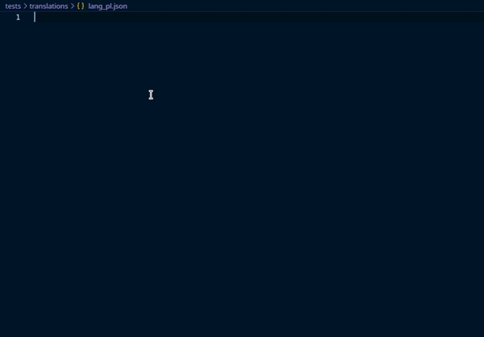

# i18n JSON Schema

JSON Schema for i18n syntax used in i18njs and i18npy.

## Usage

Add `$schema` top-level property to your JSON:

```json
{
    "$schema": "https://github.com/marverix/i18n-json-schema/releases/download/v1.0.1/schema.json",
    ...
}
```

IDE like VSCode supports it out of the box.



## Links

* [i18njs - JS library](https://github.com/roddeh/i18njs/)
* [i18npy - Python library](https://github.com/marverix/i18npy)
* [Official page of JSON Schema](https://json-schema.org/)
* [List of software that supports JSON Schema](https://json-schema.org/implementations.html)

## License

This project is licensed under the MIT License - see the [LICENSE](LICENSE) file for details.
